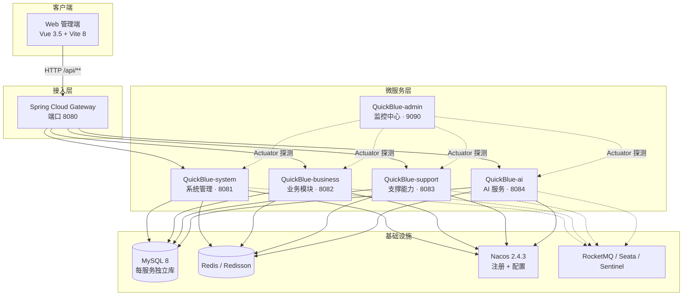

<p align="center">
  <a href="https://www.creatorblue.com">
    
  </a>
</p>

<h1 align="center">⚡ QuickBlue · 原生 AI 微服务快速开发平台</h1>

<p align="center">
  <strong>JDK 21 · Spring Cloud 2025 · Vite 8 —— 从 0 到 1 搭建企业级 AI 微服务平台</strong>
  <br/>
  开箱即用 · 前后端分离 · AI 原生 · 面向生产
</p>

<p align="center">
  
  
  
  
  
  
  
  
  
  
</p>

<p align="center">
  <a href="https://www.creatorblue.com">🌐 官网</a>
  &nbsp;|&nbsp;
  <a href="http://ide.budaos.com">🚀 在线体验</a>
  &nbsp;|&nbsp;
  <a href="#快速开始">📖 快速开始</a>
  &nbsp;|&nbsp;
  <a href="#系统架构">🏗 系统架构</a>
  &nbsp;|&nbsp;
  <a href="#功能模块">🧩 功能模块</a>
</p>

---

## 🚀 立即在线体验

**无需部署，1 分钟上手**，点开即用：

| 项 | 内容 |
| --- | --- |
| 🌐 体验地址 | **http://ide.budaos.com** |
| 👤 体验账号 | `admin` |
| 🔑 体验密码 | `nq963369#` |

> 体验环境包含完整功能：系统管理、RBAC 权限、服务监控大盘、AI 模型 / 知识库 / 应用编排等。欢迎 Star ⭐ 支持开源。

<p align="center">
  
</p>

---

## 项目简介

**QuickBlue** 是一款面向企业级生产环境的**原生 AI 微服务快速开发平台**。基于 **JDK 21 (LTS) + Spring Cloud 2025** 微服务技术栈与 **Vite 8 + Vue 3** 前端工程化方案，内置完整的 **RBAC 权限体系、AI 应用能力（多模型接入 / RAG 知识库 / 应用编排）、服务治理、监控告警、代码生成**，帮助开发者从零快速搭建高可用、可扩展、可商业化的业务系统。

> 🧩 **双数据库版本**：本仓库开源 **MySQL 版**（各微服务数据库隔离、独立账号）；官方同步提供 **PostgreSQL 版**（含 pgvector 向量检索），数据库层由 Nacos 配置中心集中管理，切换仅调配置，业务代码零侵入。

---

## ✨ 为什么选择 QuickBlue

### 🚀 技术栈领跑，不被时代淘汰
采用**官方最新稳定技术线**：JDK 21 (LTS) 虚拟线程 + Spring Boot 3.5.10 + Spring Cloud 2025.0.1 + **Vite 8**（新一代构建引擎，毫秒级冷启动）。对比大量仍停留在 JDK 8 / Spring Boot 2.x / Webpack 的老牌框架，QuickBlue 从一开始就站在**下一个十年**的起跑线上。

### 🤖 AI 原生，不是"PPT 接入"
平台内置完整的 AI 应用体系，开箱即用：
- **多模型接入**：OpenAI / 通义千问 / Ollama / 百度文心 / 智谱等供应商统一管理，API Key 加密存储，一键激活切换
- **RAG 知识库**：知识 / 记忆双类型，向量化检索，让 AI 回答"懂你的业务"
- **应用编排**：开场白、预设问题、提示词、知识库关联、记忆开关、变量配置，像搭积木一样组装 AI 应用
- **会话管理**：多轮对话、Markdown 渲染、代码高亮，前端页面齐全

### 🏗 真正的微服务，不是"单机改多包"
网关 + 系统 + 业务 + 支撑 + AI **五大服务按领域边界拆分**，每个服务**独立数据库、独立账号、最小权限授权**。Spring Cloud Gateway 统一路由、白名单与 OpenAPI 3 文档聚合。

### 🔐 企业级安全与合规
Sa-Token 认证 + RBAC（用户 / 角色 / 菜单 / 按钮）+ 部门数据权限隔离 + 操作审计（`@AuditLog` 含 IP 归属地）+ 防重复提交 + 全局异常统一处理。

### ⚙️ 一份配置，全局生效
MySQL / Redis / Nacos 等基础设施地址全部环境变量外部化，修改 **1 个 `.env` 文件**即可切换任意环境，告别"改 5 个 yml 才能换库"的痛。

### 📦 开箱即用的生产力工具
MyBatis-Plus 代码生成（Velocity / FreeMarker 模板）一键产出 CRUD 全套代码；Excel 导入导出、S3 对象存储、定时任务、二维码、多级缓存（Caffeine + Redisson）全部内置。

---

## 技术先进性

### 后端：主流 LTS + 官方最新稳定版

| 技术 | 版本 | 说明 |
| --- | --- | --- |
| **JDK** | **21 (LTS)** | 官方最新长期支持版本，虚拟线程 / Record / 模式匹配 |
| **Spring Boot** | **3.5.10** | 当前最新稳定版，GraalVM / 虚拟线程 / 可观测性原生支持 |
| **Spring Cloud** | **2025.0.1** | 2025 年度最新版本线 |
| **Spring Cloud Alibaba** | **2025.0.0.0** | 与 Spring Cloud 2025 完全对齐 |
| **Nacos** | **2.4.3** | 注册中心 + 配置中心，共享配置 + 服务级配置分离 |
| **MyBatis-Plus** | **3.5.7** | 逻辑删除、分页、代码生成（Velocity / FreeMarker） |
| **Druid + p6spy** | **1.2.25** | 连接池监控 + SQL 日志 |
| **Redisson** | **3.50.0** | 分布式锁、分布式缓存 |
| **Caffeine** | **3.1.8** | 本地一级缓存（多级缓存架构） |
| **Sa-Token** | **1.44.0** | 轻量级认证鉴权 |
| **Knife4j** | **4.6.0** | OpenAPI 3 网关聚合 API 文档 |
| **Spring Boot Admin** | **3.4.4** | 服务健康监控中心 |
| **OpenFeign + OkHttp** | **13.1 / 4.12** | 声明式调用 + 高性能客户端 + 请求/响应压缩 |
| **RocketMQ / Seata / Sentinel** | 可选 | 消息队列 / 分布式事务 / 熔断降级，按需引入 |
| **EasyExcel + POI** | **4.0.3 / 5.4.1** | 高性能大数据量 Excel 导入导出 |
| **Hutool / Fastjson2 / Guava** | 全量 | 行业标准工具集 |
| **ip2region / ZXing / AWS S3** | 周边 | IP 归属地 / 二维码 / S3 兼容对象存储 |

### 前端：Vite 8 新一代构建引擎 + Vue 3.5

| 技术 | 版本 | 说明 |
| --- | --- | --- |
| **Vite** | **8.2** | 新一代构建引擎，原生 ESM，毫秒级冷启动、极速热更新 |
| **Vue** | **3.5.41** | 组合式 API + `<script setup>`，最新稳定版 |
| **Vue Router / Pinia** | **4.3.2 / 2.1.7** | 官方路由与状态管理 |
| **Ant Design Vue** | **4.2.6** | 企业级 UI 组件库 |
| **Node.js** | **≥ 24** | 最新 LTS 要求 |
| **Vitest** | **4.1** | 开箱即用的单元测试 |
| **ECharts / ApexCharts** | **5.6 / 5.3** | 大屏与图表可视化 |
| **ESLint / Prettier / Stylelint** | 全套 | 代码质量工程化 |
| 工程化 | — | 多环境构建、路由懒加载、手动分包、gzip 自动压缩 |

---

## 系统架构



### 服务端口

| 服务 | 端口 | 说明 |
| --- | --- | --- |
| QuickBlue-gateway | 8080 | 微服务网关（路由 / 鉴权 / 文档聚合） |
| QuickBlue-system | 8081 | 系统管理服务（RBAC / 组织 / 字典等） |
| QuickBlue-business | 8082 | 业务服务（OA 等业务模块） |
| QuickBlue-support | 8083 | 支撑服务（监控 / 文件 / 任务等公共能力） |
| QuickBlue-ai | 8084 | AI 服务（模型 / 知识库 / 应用 / 会话） |
| QuickBlue-admin | 9090 | 管理端聚合服务 + Spring Boot Admin 监控中心 |

---

## 功能模块

| 模块 | 归属服务 | 功能说明 |
| --- | --- | --- |
| 用户管理 | system | 用户 CRUD、状态管理、密码策略（登录失败锁定） |
| 角色管理 | system | 角色 CRUD、菜单授权、按钮权限 |
| 菜单管理 | system | 菜单 / 路由 / 按钮动态配置，前端路由权限联动 |
| 组织管理 | system | 部门树、负责人、排序、数据权限范围 |
| 员工管理 | system | 员工档案、部门归属、删除校验 |
| 字典管理 | system | 数据字典维护 |
| 操作日志 | log | 全链路操作审计（异步落库，含 IP 归属地） |
| 服务监控 | support | 各实例健康 / JVM 内存 / 线程 / QPS 聚合大盘 |
| 文件管理 | support | 文件上传下载、S3 兼容对象存储 |
| 定时任务 | support | 任务调度管理 |
| **AI 模型管理** | ai | 多供应商（OpenAI / 通义千问 / Ollama 等）统一接入、API Key 加密、激活切换 |
| **AI 知识库** | ai | 知识 / 记忆双类型、向量化检索（RAG） |
| **AI 应用编排** | ai | 开场白 / 提示词 / 知识库关联 / 记忆开关 / 变量配置 |
| **AI 会话管理** | ai | 多轮对话、Markdown 渲染、代码高亮 |
| 业务模块 | business | OA 等业务功能 |
| 安装部署 | admin-web | 前端安装配置向导页面 |

---

## 快速开始

### 环境要求

| 组件 | 版本要求 |
| --- | --- |
| JDK | **21+** |
| Maven | 3.9+ |
| Node.js | **24+** |
| MySQL | 8.0+ |
| Redis | 6+ |
| Nacos | 2.4.3（独立部署） |
| RocketMQ / Seata / Sentinel | 可选，按需启用 |

### 1. 初始化数据库

执行 `QuickBlue-parent/database/mysql/` 下的脚本（按编号顺序）：

```sql
-- 01_create_databases.sql   创建 4 个数据库及专用账号（utf8mb4）
-- 02_migrate_support.sql    Support 服务表结构与数据
-- 03_migrate_system.sql     System 服务表结构与数据
-- 04_migrate_business.sql   Business 服务表结构与数据
-- 05_create_ai_tables.sql   AI 服务表结构
```

### 2. 配置环境变量（一处配置，全局生效）

```bash
cd QuickBlue-parent
copy .env.example .env    # Linux/Mac: cp .env.example .env

# 按需修改 .env：MySQL / Redis / Nacos / pgvector 地址
# 之后改任何基础设施地址，只动这一个文件，重启服务即生效
```

> 所有服务通过 `spring.config.import` 自动加载根目录 `.env`，也支持系统环境变量 / IDE 启动配置覆盖。

### 3. 导入 Nacos 配置

将 `QuickBlue-parent/nacos_config/` 目录下的配置导入 Nacos：

- `common/` 下的共享配置（`mysql-common.yaml`、`redis-common.yaml`、`sa-token-common.yaml` 等）
- `services/` 下的服务配置（按服务名导入）

详细步骤见 [Nacos配置手册.md](QuickBlue-parent/nacos_config/Nacos配置手册.md)。

### 4. 启动中间件

启动 MySQL、Redis（默认 `localhost:6379`，密码按 `redis-common.yaml` 配置）与 Nacos。

### 5. 启动后端服务

在 `QuickBlue-parent` 目录下按顺序启动：

```bash
mvn compile

# 服务启动顺序
java -jar QuickBlue-gateway/target/QuickBlue-gateway-4.0.0.jar      # 8080 网关
java -jar QuickBlue-modules/QuickBlue-system/target/QuickBlue-system-4.0.0.jar   # 8081
java -jar QuickBlue-modules/QuickBlue-business/target/...            # 8082
java -jar QuickBlue-modules/QuickBlue-support/target/...            # 8083
java -jar QuickBlue-modules/QuickBlue-ai/target/...                 # 8084
java -jar QuickBlue-admin/target/QuickBlue-admin-4.0.0.jar          # 9090 监控中心
```

### 6. 启动前端

```bash
cd QuickBule-admin-web
npm install
npm run dev        # 默认 http://localhost:5173，/api 代理到网关 8080
```

生产构建：

```bash
npm run build:prod      # 产物输出到 dist/，Vite 自动 gzip 压缩 + 路由分包
```

### 7. 访问 API 文档

网关聚合了全部微服务的 OpenAPI 3 文档：

```
http://localhost:8080/doc.html        # Knife4j 聚合文档
http://localhost:8080/QuickBlue-system/v3/api-docs
```

---

## 相关文档

| 文档 | 说明 |
| --- | --- |
| [Nacos配置手册.md](QuickBlue-parent/nacos_config/Nacos配置手册.md) | Nacos 配置导入与命名空间说明 |
| [QuickBlue微服务架构评估报告 v5.0](QuickBlue-parent/doc/QuickBlue微服务架构评估报告_qoder_v5.0.md) | 架构评审与演进建议 |
| [OpenFeign优化完整指南.md](QuickBlue-parent/doc/OpenFeign优化完整指南.md) | 服务调用性能优化实践 |
| [AI功能开发清单.md](QuickBlue-parent/doc/AI功能开发清单.md) | AI 服务能力清单 |
| [JQ两平台对比分析报告.md](QuickBlue-parent/doc/JQ两平台对比分析报告.md) | 平台选型对比 |

---

## 开源协议

本项目基于 [MIT](LICENSE) 协议开源，遵循开放、共享的开源精神，可免费用于商业与学习场景。

**版本说明**：当前开源为 **MySQL 版**；官方同步提供 **PostgreSQL 版**（含 pgvector 向量检索），数据库类型通过 Nacos 配置中心切换，业务代码零侵入。

---

## 联系我们

- 🌐 官网：<https://www.creatorblue.com>
- ✉️ 邮箱：28449472@163.com

> 如果你觉得这个项目对你有帮助，欢迎 **Star ⭐** 支持，感谢开源路上每一位同行者。
