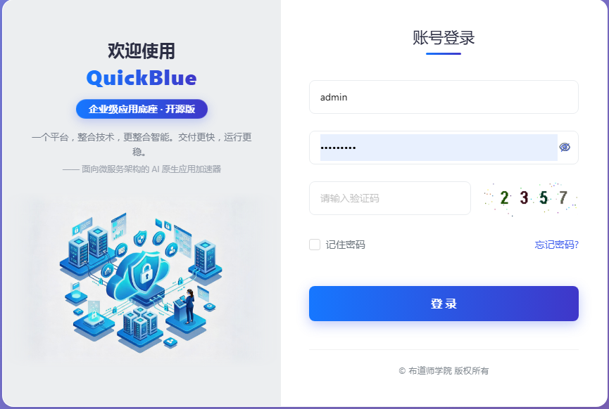
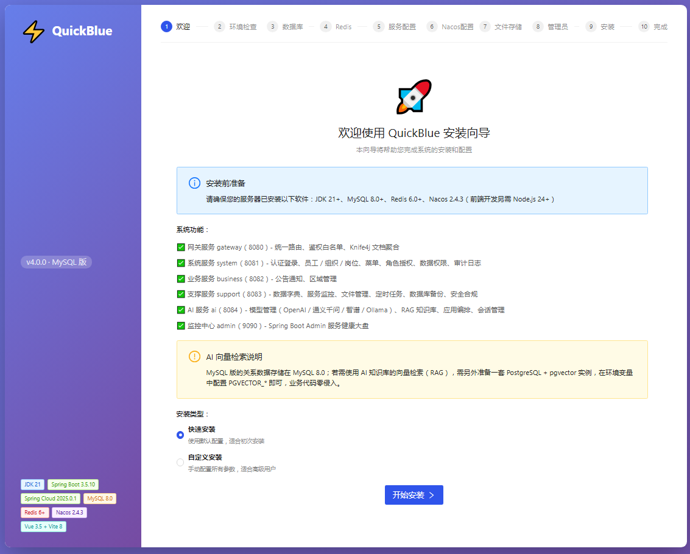
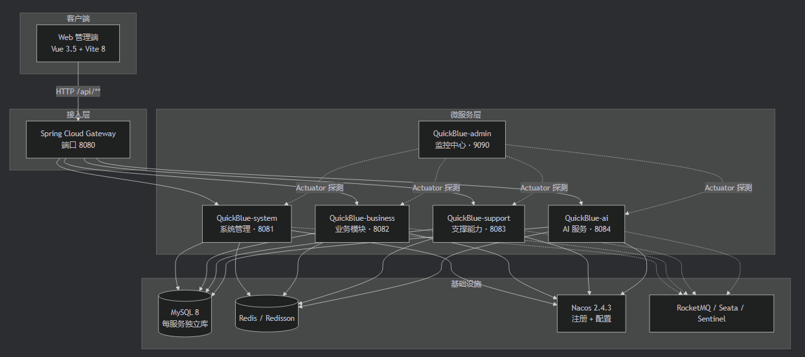
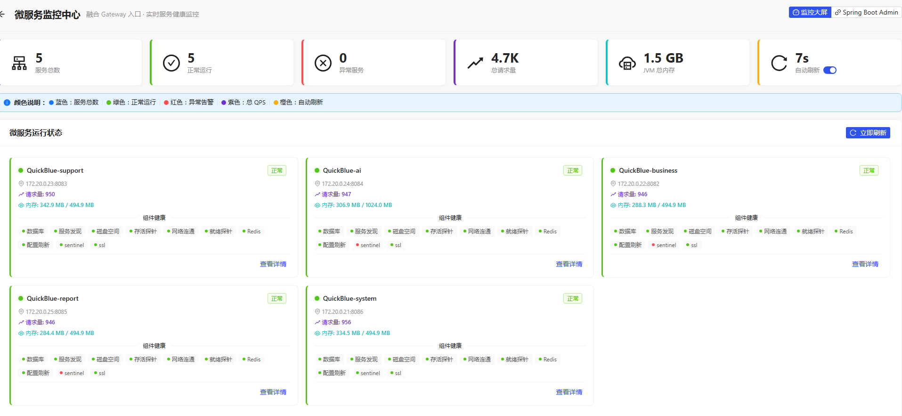
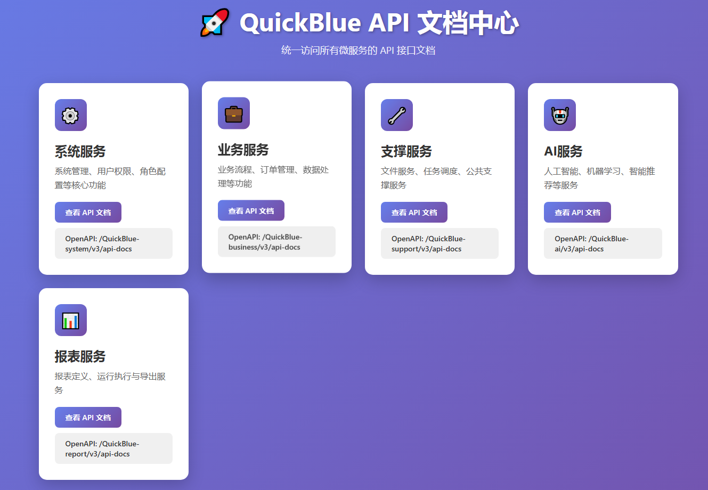

<p align="center">
  <a href="https://www.creatorblue.com">
    
  </a>
</p>

<h1 align="center">⚡ QuickBlue · 原生 AI 微服务快速开发平台</h1>

<p align="center">
  <strong>JDK 21 · Spring Cloud 2025 · Vite 8 —— 从 0 到 1 搭建企业级 AI 微服务平台</strong>
  <br/>
  开箱即用 · 前后端分离 · AI 原生 · 面向生产
</p>

<p align="center">
  
  
  
  
  
  
  
  
  
  
</p>

<p align="center">
  <a href="#try">🚀 在线体验</a>
  &nbsp;|&nbsp;
  <a href="#prepare">🛠 环境准备</a>
  &nbsp;|&nbsp;
  <a href="#quickstart">⚡ 快速搭建（推荐）</a>
  &nbsp;|&nbsp;
  <a href="#manual">📋 手动部署</a>
  &nbsp;|&nbsp;
  <a href="#arch">🏗 系统架构</a>
  &nbsp;|&nbsp;
  <a href="#modules">🧩 功能模块</a>
  &nbsp;|&nbsp;
  <a href="#docs">📚 相关文档</a>
</p>

---

## 一、先在线体验，再动手搭建<a id="try"></a>

**不想先装环境？** 直接点开体验，1 分钟看到完整功能，再决定要不要本地搭建：

| 项 | 内容 |
| --- | --- |
| 🌐 体验地址 | **http://ide.budaos.com** |
| 👤 体验账号 | `admin` |
| 🔑 体验密码 | `nq963369#` |

> 体验环境包含完整功能：系统管理、RBAC 权限、服务监控大盘、AI 模型 / 知识库 / 应用编排等。

<p align="center">
  
</p>

---

## 二、QuickBlue 是什么

**QuickBlue** 是一款面向企业级生产环境的**原生 AI 微服务快速开发平台**。基于 **JDK 21 (LTS) + Spring Cloud 2025** 微服务技术栈与 **Vite 8 + Vue 3** 前端工程化方案，内置完整的 **RBAC 权限体系、AI 应用能力（多模型接入 / RAG 知识库 / 应用编排）、服务治理、监控告警、数据安全与合规**，帮助开发者从零快速搭建高可用、可扩展、可商业化的业务系统。

> 🧩 **双数据库版本**：本仓库开源 **MySQL 版**（各微服务数据库隔离、独立账号）；官方同步提供 **PostgreSQL 版**（含 pgvector 向量检索），数据库层由 Nacos 配置中心集中管理，切换仅调配置，业务代码零侵入。

---

## 三、核心特性

### 🎯 向导式安装：不懂运维也能 10 分钟装好

这是 QuickBlue 与绝大多数开源框架**最不一样的地方**——别人给你一堆 yml 和 SQL 让你自己拼装，QuickBlue 直接给你一个**浏览器安装向导**：**填地址 → 点"测试连接" → 下一步 → 开始安装**，全程鼠标操作，**不用敲命令、不用手写一行配置、不用手工粘贴 Nacos 配置**。

| 传统开源框架的落地方式 | QuickBlue 向导式安装 |
| --- | --- |
| 手工执行 SQL 建库、建账号、授权 | ✅ 自动创建 4 个库 + 4 个最小权限专用账号 |
| 手工按序导入建表脚本，顺序错了就翻车 | ✅ 自动按 01~05 顺序导入表结构与初始化数据 |
| 手工往 Nacos 一条条粘贴十几个配置 | ✅ 自动生成并导入共享配置 + 各服务配置 |
| 换环境要挨个改 yml | ✅ 自动生成 `.env`，一处配置全局生效 |
| 出错只能翻日志猜原因 | ✅ 逐步连通性测试 + 实时进度条 + 可展开安装日志 |

<p align="center">
  
</p>

### 🤖 AI 原生，不是"PPT 接入"

- **多模型接入**：OpenAI / 通义千问（DashScope）/ 智谱 / Ollama 供应商统一管理，API Key 加密存储，一键激活切换
- **RAG 知识库**：知识 / 记忆双类型，向量化检索，让 AI 回答"懂你的业务"
- **应用编排**：开场白、预设问题、提示词、知识库关联、记忆开关、变量配置，像搭积木一样组装 AI 应用
- **会话管理**：多轮对话、Markdown 渲染、代码高亮，前端页面齐全

### 🏗 真正的微服务，不是"单机改多包"

网关 + 系统 + 业务 + 支撑 + AI **五大服务按领域边界拆分**，每个服务**独立数据库、独立账号、最小权限授权**。Spring Cloud Gateway 统一路由、白名单与 OpenAPI 3 文档聚合。

### 🔐 企业级安全与合规

Sa-Token 认证 + RBAC（用户 / 角色 / 菜单 / 按钮）+ 部门数据权限隔离 + 操作审计（`@AuditLog` 含 IP 归属地）+ 防重复提交 + 全局异常统一处理。

### ⚙️ 一份配置，全局生效

MySQL / Redis / Nacos 等基础设施地址全部环境变量外部化，修改 **1 个 `.env` 文件**即可切换任意环境，告别"改 5 个 yml 才能换库"的痛。

### 📦 开箱即用的生产力工具

EasyExcel 大数据量导入导出、S3 兼容对象存储、定时任务调度、二维码生成、单据序列号、数据脱敏、数据库备份、多级缓存（Caffeine + Redisson）全部内置，模板引擎（Velocity / FreeMarker）依赖已就位。

---

## 四、环境准备<a id="prepare"></a>

### 4.1 需要安装什么

| 组件 | 版本要求 | 是否必装 | 用途 |
| --- | --- | --- | --- |
| JDK | **21+** | ✅ 必装 | 运行后端全部微服务 |
| Maven | **3.9+** | ✅ 必装 | 后端打包 |
| MySQL | **8.0+** | ✅ 必装 | 业务数据（4 个库） |
| Redis | **6+** | ✅ 必装 | 缓存 / 分布式锁 / 会话 |
| Nacos | **2.4.3** | ✅ 必装 | 注册中心 + 配置中心 |
| Node.js | **24+** | ✅ 必装 | 运行与构建前端 |
| PostgreSQL + pgvector | 14+ / 0.7+ | ⭕ 可选 | 仅 AI 知识库向量检索需要 |
| RocketMQ / Seata / Sentinel | — | ⭕ 可选 | 消息队列 / 分布式事务 / 熔断降级，按需启用 |

### 4.2 动手前先自检

在终端依次执行，确认都能正常返回版本或连通，再进入下一步：

```bash
java -version          # 应输出 21.x
mvn -version           # 应输出 3.9+
node -v                # 应输出 v24+
mysql --version        # 应输出 8.0+
redis-cli ping         # 应返回 PONG
curl http://localhost:8848/nacos/    # Nacos 控制台可访问
```

> **前置条件**：开始安装前，请确保 **MySQL、Redis、Nacos 三个中间件已经启动**。这是新手最常见的卡点。

---

## 五、快速搭建：向导式安装（推荐，零门槛）<a id="quickstart"></a>

### 5.1 先看全貌：整个流程只有 5 步

```text
① 启动网关  →  ② 启动前端  →  ③ 浏览器打开向导  →  ④ 逐步填写并"测试连接"  →  ⑤ 点"开始安装"后登录后台
```

> 只需启动**网关**与**前端**两个进程，其余全部交给浏览器向导完成。

### 5.2 步骤 1：启动网关

```bash
cd QuickBlue-MicroAI
mvn clean package -DskipTests
java -jar QuickBlue-gateway/target/QuickBlue-gateway-4.0.0.jar     # 监听 8080
```

✅ **验证**：看到 `Started GatewayApplication` 且无报错即可（向导的全部后端接口都在网关里）。

### 5.3 步骤 2：启动前端

```bash
cd ../QuickBule-MicroAI-web
npm install
npm run dev                                                        # 监听 5173
```

✅ **验证**：终端输出 `Local: http://localhost:5173/`。

### 5.4 步骤 3：浏览器进入安装向导

打开 `http://localhost:5173`，系统会自动检测安装状态并**直接进入向导**（也可手动访问 `http://localhost:5173/#/install`）。

向导共 10 步，每步填写要点如下：

| 步骤 | 你要做什么 | 关键提示 |
| --- | --- | --- |
| 1 欢迎 | 确认版本与环境要求 | 当前为 **v4.0.0 MySQL 版** |
| 2 环境检查 | 点击检查，等待结果 | 未通过项可跳过，不阻断安装 |
| 3 数据库 | 填 MySQL 地址、端口、管理员账号密码 | 管理员需具备**建库与授权**权限 |
| 4 Redis | 填地址、端口、密码、库号 | 点"测试连接"验证 |
| 5 服务端口 | 确认各服务端口 | 默认 8080~8084，无冲突直接下一步 |
| 6 Nacos | 填 Nacos 地址与命名空间 | 默认命名空间 `QuickBlue-dev`、分组 `QuickBlue_GROUP` |
| 7 文件存储 | 选本地或 S3 兼容存储 | 本地存储填写上传目录即可 |
| 8 管理员 | 设置超级管理员账号密码 | 请牢记，安装完成后用于登录 |
| 9 安装 | 点击**开始安装** | 自动建库、建账号、导入表结构与数据、写入 Nacos 配置 |
| 10 完成 | 查看访问信息与账号 | 可直接"进入系统" |

> 每一步都提供 **"测试连接"** 即时验证，填错马上能发现。

### 5.5 步骤 4：开始安装并等待完成

点击**开始安装**，向导会实时显示进度条与可展开的安装日志，自动完成：建库建账号 → 导入 01~05 脚本 → 初始化数据 → 生成并导入 Nacos 配置 → 创建管理员账号。

### 5.6 步骤 5：验证安装结果

| 检查项 | 地址 | 预期结果 |
| --- | --- | --- |
| 管理后台 | `http://localhost:8080/admin` | 可打开登录页，用管理员账号登录成功 |
| API 文档中心 | `http://localhost:8080/doc.html` | 可切换查看系统 / 业务 / 支撑 / AI 全部接口 |
| 监控中心 | `http://localhost:9090` | 可看到已注册服务的健康状态 |

> 其余微服务（system / business / support / ai）可在安装完成后再逐个启动，启动命令见[手动部署](#manual) 6.5 节。

---

## 六、手动部署（想逐步掌控时用）<a id="manual"></a>

按以下顺序执行即可，每步都附带验证点。

### 6.1 初始化数据库

执行 `QuickBlue-MicroAI/database/mysql/` 下的脚本，**必须按编号顺序**：

```sql
-- 01_create_databases.sql   创建 4 个数据库（support / system / business / ai）
--                           及各自专用账号（最小权限授权）
-- 02_migrate_support.sql    Support 服务表结构与数据
-- 03_migrate_system.sql     System 服务表结构与数据
-- 04_migrate_business.sql   Business 服务表结构与数据
-- 05_create_ai_tables.sql   AI 服务表结构
```

✅ **验证**：能看到 `quickblue_support` / `quickblue_system` / `quickblue_business` / `quickblue_ai` 四个库及其数据表。

### 6.2 配置环境变量（一处配置，全局生效）

```bash
cd QuickBlue-MicroAI
copy .env.example .env    # Linux/Mac: cp .env.example .env

# 按需修改 .env：Nacos / MySQL / Redis / pgvector 地址
# 之后改任何基础设施地址，只动这一个文件，重启服务即生效
```

> 所有服务通过 `spring.config.import` 自动加载项目根目录 `.env`，也支持系统环境变量 / IDE 启动配置覆盖。
> 未复制 `.env` 时，各服务会回退到 `nacos_config` 中的默认值（与本地开发一致）。

### 6.3 导入 Nacos 配置

将 `QuickBlue-MicroAI/nacos_config/` 下的配置导入 Nacos（Group 均为 `QuickBlue_GROUP`）：

- `common/` 下的共享配置：`common-config.yaml`、`mysql-common.yaml`、`redis-common.yaml`、`sa-token-common.yaml`、`level3-protect-common.yaml`
- `services/` 下的服务配置：`QuickBlue-gateway.yaml`、`QuickBlue-system.yaml`、`QuickBlue-business.yaml`、`QuickBlue-support.yaml`、`QuickBlue-ai.yaml`、`QuickBlue-admin.yaml`

> 详细步骤与命名空间说明见**《Nacos 配置手册》**（文档清单见[相关文档](#docs)）。

### 6.4 打包后端

在 `QuickBlue-MicroAI` 目录下执行：

```bash
mvn clean package -DskipTests
```

✅ **验证**：各服务 `target/` 目录下生成对应的 `*-4.0.0.jar`。

### 6.5 启动后端服务（建议按此顺序）

```bash
java -jar QuickBlue-gateway/target/QuickBlue-gateway-4.0.0.jar                          # 8080 网关（先启动）
java -jar QuickBlue-modules/QuickBlue-system/target/QuickBlue-system-4.0.0.jar          # 8081
java -jar QuickBlue-modules/QuickBlue-business/target/QuickBlue-business-4.0.0.jar      # 8082
java -jar QuickBlue-modules/QuickBlue-support/target/QuickBlue-support-4.0.0.jar        # 8083
java -jar QuickBlue-modules/QuickBlue-ai/target/QuickBlue-ai-4.0.0.jar                  # 8084
java -jar QuickBlue-admin/target/QuickBlue-admin-4.0.0.jar                              # 9090 监控中心
```

✅ **验证**：打开 `http://localhost:9090`，应能看到上述服务陆续注册上线。
> 也可直接在 IDE 中运行各服务的 `XxxApplication` 启动类（推荐开发期使用）。

### 6.6 启动前端

```bash
cd QuickBule-MicroAI-web
npm install
npm run dev        # 默认 http://localhost:5173，/api 与 /actuator 代理到网关 8080
```

生产构建：

```bash
npm run build:prod      # 产物输出到 dist/，生产模式 base 为 /admin，terser 压缩 + 按依赖分包
```

> 其他环境：`npm run build:test`（base `/admin/`）、`npm run build:pre`。
> 需要 gzip/br 压缩时，可在 `vite.config.js` 中启用已引入的 `vite-plugin-compression2`（当前默认未挂载）。

### 6.7 验证：访问 API 文档中心

网关聚合了全部微服务的 OpenAPI 3 文档，无需记住各服务端口：

| 入口 | 地址 | 说明 |
| --- | --- | --- |
| Knife4j 聚合文档 | `http://localhost:8080/doc.html` | 一个页面查看系统 / 业务 / 支撑 / AI 全部接口 |
| 系统服务文档 | `http://localhost:8080/QuickBlue-system/v3/api-docs` | 认证 / RBAC / 组织 / 岗位 / 审计等 |
| 业务服务文档 | `http://localhost:8080/QuickBlue-business/v3/api-docs` | 公告 / 区域 / OA 等 |
| 支撑服务文档 | `http://localhost:8080/QuickBlue-support/v3/api-docs` | 字典 / 文件 / 任务 / 监控 / 安全等 |
| AI 服务文档 | `http://localhost:8080/QuickBlue-ai/v3/api-docs` | 模型 / 知识库 / 应用编排 / 会话 |

> 实际业务调用请统一使用网关路由，例如：`POST http://localhost:8080/api/system/auth/login`。

---

## 七、系统架构<a id="arch"></a>

<p align="center">
  
</p>

<p align="center">
  
</p>

### 7.1 服务端口

| 服务 | 端口 | 说明 |
| --- | --- | --- |
| QuickBlue-gateway | 8080 | **统一服务访问入口**：微服务网关（路由 / 鉴权 / 文档聚合），所有微服务接口均由此统一暴露 |
| QuickBlue-system | 8081 | 系统管理服务（认证 / RBAC / 组织 / 岗位 / 数据权限） |
| QuickBlue-business | 8082 | 业务服务（公告通知 / 区域等业务模块） |
| QuickBlue-support | 8083 | 支撑服务（字典 / 监控 / 文件 / 定时任务 / 备份 / 安全等公共能力） |
| QuickBlue-ai | 8084 | AI 服务（模型 / 知识库 / 应用编排 / 会话） |
| QuickBlue-admin | 9090 | Spring Boot Admin 监控中心 |

### 7.2 统一服务访问入口（QuickBlue-gateway 8080）

**网关是所有服务的唯一访问入口**，业务调用与前端请求只需记住 `http://localhost:8080`，无需直连各服务端口：

```text
http://localhost:8080                  # 统一服务访问入口
http://localhost:8080/doc.html         # API 文档中心（聚合全部微服务接口）
```

| 服务 | 统一业务接口入口 | 统一 API 文档入口 |
| --- | --- | --- |
| 系统服务 | `http://localhost:8080/api/system/**` | `http://localhost:8080/QuickBlue-system/v3/api-docs` |
| 业务服务 | `http://localhost:8080/api/business/**`、`/api/oa/**` | `http://localhost:8080/QuickBlue-business/v3/api-docs` |
| 支撑服务 | `http://localhost:8080/api/support/**` | `http://localhost:8080/QuickBlue-support/v3/api-docs` |
| AI 服务 | `http://localhost:8080/api/ai/**` | `http://localhost:8080/QuickBlue-ai/v3/api-docs` |

<p align="center">
  
</p>

> 网关通过 Knife4j 自动聚合上述服务的 OpenAPI 3 文档，`/doc.html` 一个页面即可切换查看系统 / 业务 / 支撑 / AI 全部接口。
> 独立文档路径由网关自动转发到对应服务，并经过 `OpenApiServerFilter` 修正 `servers` 字段，确保调试请求仍统一走网关。

---

## 八、功能模块<a id="modules"></a>

### 系统服务 system（8081）

| 模块 | 入口 | 说明 |
| --- | --- | --- |
| 认证登录 | `AuthController` / `SecureLoginController` | 登录登出、验证码、密码安全策略（失败锁定） |
| 员工管理 | `StaffController` | 员工档案、部门归属、角色分配 |
| 组织管理 | `OrganizationController` | 部门树、负责人、排序 |
| 岗位管理 | `JobPostController` | 岗位维护 |
| 菜单管理 | `NavMenuController` | 菜单 / 路由 / 按钮动态配置，前端路由权限联动 |
| 角色授权 | `AuthRoleController` / `AuthRoleMenuController` / `AuthRoleStaffController` | 角色 CRUD、菜单授权、人员授权 |
| 数据权限 | `DataPermissionConfigController` / `AuthRoleDataPermissionController` / `SysPermissionDataRuleController` | 部门数据范围、行级规则 |
| 登录日志 | `LoginRecordController` | 登录审计 |
| 操作审计 | `AuditLogController`（`@AuditLog` 切面） | 全链路操作审计，异步落库，含 IP 归属地 |

### 支撑服务 support（8083）

| 模块 | 入口 | 说明 |
| --- | --- | --- |
| 数据字典 | `DictController` | 字典分类与字典项维护 |
| 服务监控 | `MonitorController` | 各实例健康 / JVM 内存 / 线程 / QPS 聚合大盘 |
| 文件管理 | `AdminAttachmentController` / `AttachmentController` | 上传下载、S3 兼容对象存储 |
| 定时任务 | `JobTaskController` | 任务调度管理 |
| 缓存管理 | `CacheController` | 多级缓存（Caffeine + Redisson）运维 |
| 数据库备份 | `DatabaseBackupController` | 备份与恢复 |
| 单据序列号 | `SerialCodeController` | 序列号规则 |
| 系统配置 | `SystemConfigController` | 运行期参数配置 |
| 消息 / 反馈 | `NotificationController` / `SuggestionController` | 站内消息与意见反馈 |
| 帮助文档 / 更新日志 | `HelpCenterController` / `ReleaseLogController` | 文档与版本记录 |
| 安全与合规 | `ApiCipherController` / `DataMaskingController` / `ProtectController` / `SecurePasswordServiceController` | API 加解密、数据脱敏、三级等保、密码安全 |
| Nacos 配置 | `nacos/controller/NacosConfigController` | 配置中心在线管理 |

### AI 服务 ai（8084）

| 模块 | 说明 |
| --- | --- |
| **AI 模型管理**（`ai/llm`） | 多供应商（OpenAI / 通义千问 DashScope / 智谱 / Ollama）统一接入，API Key 加密，激活切换 |
| **AI 知识库**（`ai/llm` 的 `AiragKnowledge`） | 知识 / 记忆双类型，向量化检索（RAG），MySQL 版向量存储依赖独立 PostgreSQL + pgvector |
| **AI 应用编排**（`ai/app` + `ai/prompts` + `ai/agent`） | 开场白 / 提示词 / 知识库关联 / 记忆开关 / 变量配置 |
| **AI 会话管理**（`ai/chat` + `ai/session`） | 多轮对话、会话管理、Markdown 渲染、代码高亮 |

### 业务服务 business（8082）

| 模块 | 说明 |
| --- | --- |
| 公告通知（`views/business/notice`） | 通知公告发布与管理 |
| 区域管理（`views/business/region`） | 行政区域数据 |

### 前端（QuickBule-MicroAI-web）

| 模块 | 说明 |
| --- | --- |
| 安装部署向导（`views/install`） | `install-check.vue` / `install-wizard.vue` 环境检测与初始化引导 |
| 系统 / 支撑 / 业务 / AI 页面 | `views/system`、`views/support`、`views/business`、`views/ai` |

---

## 九、技术栈

### 后端：主流 LTS + 官方最新稳定版

| 技术 | 版本 | 说明 |
| --- | --- | --- |
| **JDK** | **21 (LTS)** | 官方最新长期支持版本，虚拟线程 / Record / 模式匹配 |
| **Spring Boot** | **3.5.10** | 当前最新稳定版，GraalVM / 虚拟线程 / 可观测性原生支持 |
| **Spring Cloud** | **2025.0.1** | 2025 年度最新版本线 |
| **Spring Cloud Alibaba** | **2025.0.0.0** | 与 Spring Cloud 2025 完全对齐 |
| **Nacos** | **2.4.3** | 注册中心 + 配置中心，共享配置 + 服务级配置分离 |
| **MyBatis-Plus** | **3.5.7** | 逻辑删除、分页、代码生成（Velocity / FreeMarker） |
| **Druid + p6spy** | **1.2.25 / 3.9.1** | 连接池监控 + SQL 日志 |
| **Redisson** | **3.50.0** | 分布式锁、分布式缓存 |
| **Caffeine** | **3.1.8** | 本地一级缓存（多级缓存架构） |
| **Sa-Token** | **1.44.0** | 轻量级认证鉴权 |
| **Knife4j** | **4.6.0** | OpenAPI 3 网关聚合 API 文档 |
| **Spring Boot Admin** | **3.4.4** | 服务健康监控中心 |
| **OpenFeign + OkHttp** | **13.1 / 4.12** | 声明式调用 + 高性能客户端 + 请求/响应压缩 |
| **RocketMQ / Seata / Sentinel** | 可选 | 消息队列 / 分布式事务 / 熔断降级，按需引入 |
| **EasyExcel + POI** | **4.0.3 / 5.4.1** | 高性能大数据量 Excel 导入导出 |
| **Hutool / Fastjson2 / Guava** | 全量 | 行业标准工具集 |
| **ip2region / ZXing / AWS S3** | 周边 | IP 归属地 / 二维码 / S3 兼容对象存储 |

### 前端：Vite 8 新一代构建引擎 + Vue 3.5

| 技术 | 版本 | 说明 |
| --- | --- | --- |
| **Vite** | **8.2** | 新一代构建引擎，原生 ESM，毫秒级冷启动、极速热更新 |
| **Vue** | **3.5.41** | 组合式 API + `<script setup>`，最新稳定版 |
| **Vue Router / Pinia** | **4.3.2 / 2.1.7** | 官方路由与状态管理 |
| **Ant Design Vue** | **4.2.6** | 企业级 UI 组件库 |
| **Node.js** | **≥ 24** | 最新 LTS 要求 |
| **Vitest** | **4.1** | 开箱即用的单元测试 |
| **ECharts / ApexCharts** | **5.6 / 5.3** | 大屏与图表可视化 |
| **ESLint / Prettier / Stylelint** | 全套 | 代码质量工程化 |
| 工程化 | — | 多环境构建（`dev` / `test` / `pre` / `production`）、路由懒加载、按依赖手动分包 |

---

## 十、目录结构

```text
QuickBlue-MicroAI/
├── LICENSE
├── README.md
├── QuickBlue-MicroAI/                    # 后端（Maven 父工程 com.budaos:QuickBlue-MicroAI:4.0.0）
│   ├── .env.example                      # 唯一配置来源模板，复制为 .env 后全局生效
│   ├── pom.xml
│   ├── database/mysql/                   # 01~05 建库建表脚本（每服务独立库 + 独立账号）
│   ├── nacos_config/                     # Nacos 配置：common/ 共享 + services/ 服务级
│   │   └── Nacos配置手册.md
│   ├── doc/images/                       # 文档图片
│   ├── QuickBlue-common/                 # 通用组件：core / database / redis / security
│   │                                     #           swagger / web / log / excel
│   ├── QuickBlue-api/                    # Feign 接口契约：system / business / support / ai
│   ├── QuickBlue-modules/                # 业务服务（聚合模块）
│   │   ├── QuickBlue-system/             # 8081
│   │   ├── QuickBlue-business/           # 8082
│   │   ├── QuickBlue-support/            # 8083
│   │   └── QuickBlue-ai/                 # 8084
│   ├── QuickBlue-gateway/                # 8080 网关
│   └── QuickBlue-admin/                  # 9090 Spring Boot Admin
└── QuickBule-MicroAI-web/                # 前端（Vite 8 + Vue 3.5 + Ant Design Vue 4）
    ├── index.html
    ├── package.json
    ├── vite.config.js                    # dev 端口 5173，/api 代理到 8080
    └── src/                              # api / assets / components / layout / router
                                          # store / views（ai business install support system）
```

---

## 十一、相关文档<a id="docs"></a>

以下为配套的进阶文档，**具体链接地址后续补充**：

| 文档名称 | 说明 | 链接 |
| --- | --- | --- |
| Nacos 配置手册 | Nacos 配置导入、命名空间、MySQL / PostgreSQL 双版本切换 | 待补充 |
| 部署与运维指南 | 生产环境部署、进程守护、日志与备份策略 | 待补充 |
| 环境变量（.env）说明 | 全部可配项的取值说明与多环境切换示例 | 待补充 |
| 数据库脚本说明 | 01~05 脚本的执行顺序、账号与权限设计 | 待补充 |
| AI 模块使用指南 | 模型接入、知识库与 RAG 配置、应用编排与会话 | 待补充 |
| 权限与数据权限指南 | RBAC 模型、菜单按钮授权、部门数据隔离规则 | 待补充 |
| Excel 模块说明 | `QuickBlue-common-excel` 导入导出用法 | 待补充 |
| 前端开发指南 | 目录约定、路由与权限联动、多环境构建 | 待补充 |
| 接口规范与网关说明 | 统一路由前缀、鉴权白名单、OpenAPI 3 聚合规则 | 待补充 |
| 常见问题排查（FAQ） | 安装与运行期高频问题的定位与解决 | 待补充 |
| 开源协议（LICENSE） | MIT 开源协议 | 待补充 |

---

## 十二、常见问题

| 问题 | 排查方向 |
| --- | --- |
| 数据库连接失败 | 检查地址、端口、账号密码；MySQL 管理员账号需具备**建库与授权**权限 |
| Redis 连接失败 | 检查 Redis 是否启动、密码与库号是否正确 |
| Nacos 连接失败 | 检查 8848 端口、命名空间 `QuickBlue-dev` 与分组 `QuickBlue_GROUP` |
| 端口被占用 | 网关 8080、system 8081、business 8082、support 8083、ai 8084、admin 9090 |
| 向导打不开 / 一直转圈 | 确认网关 8080 已启动，前端 `/api` 代理指向 8080 |
| AI 知识库向量检索不可用 | 需额外准备 PostgreSQL + pgvector 并配置 `PGVECTOR_*` |
| 生产构建页面空白 | 生产模式 base 为 `/admin`，需用 Nginx 按该前缀部署 |

---

## 开源协议

本项目基于 **Apache 2.0** 协议开源，遵循开放、共享的开源精神，可免费用于商业与学习场景。

**版本说明**：当前开源为 **MySQL 版**；官方同步提供 **PostgreSQL 版**（含 pgvector 向量检索），数据库类型通过 Nacos 配置中心切换，业务代码零侵入。

---

## 联系我们

- 🌐 官网：<https://www.creatorblue.com>
- ✉️ 邮箱：28449472@QQ.com

> 如果你觉得这个项目对你有帮助，欢迎 **Star ⭐** 支持，感谢开源路上每一位同行者。
